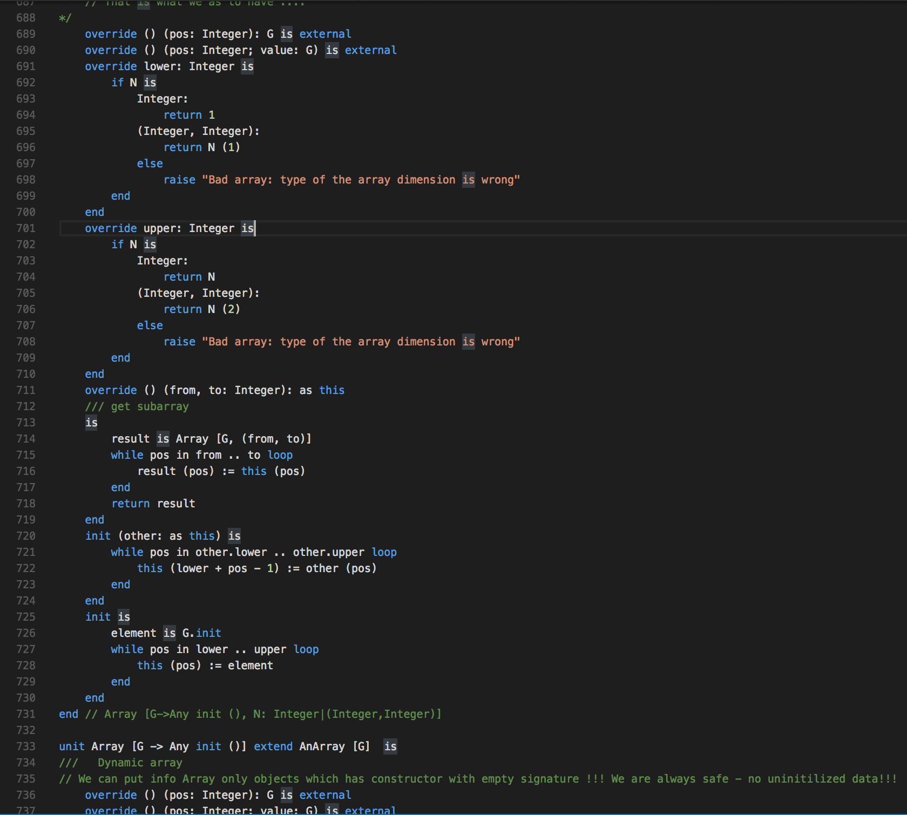
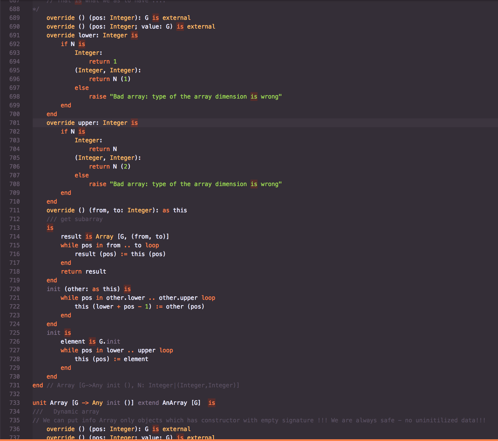

# SLang code highlighter

 

This VS Code extension provides syntax highlighting for **SLang**, the experimental general-purpose programming language described by Alexey Kanatov and Eugene Zouev. It is distinct from the Shader Slang language. The extension recognizes `.slang` files and registers the VS Code language ID `slang-academic`.

## About SLang

SLang explores how procedural, object-oriented, functional, and concurrent programming can fit into one language. Its central construct is the *unit*, which brings together ideas from modules, classes, and types. The language design also discusses multiple inheritance, reference and value objects, immutability, and type safety.

Kanatov and Zouev presented an overview of SLang in their [2017 paper, *SLang: Current Status and Next Steps*](https://doi.org/10.1145/3166094.3166095). This highlighter was first published in 2018. Their later paper, [*Unified type system for the modern general-purpose programing language*](https://www.researchgate.net/publication/365217064_Unified_type_system_for_the_modern_general-purpose_programing_language), develops the type-system ideas using SLang examples.

This extension provides highlighting and basic editor configuration; it does not include a compiler or language server.

## Screenshots

## Release Notes

### 0.0.1

Initial release of extension.

## 0.0.2

- Add few more keywords support

## 0.0.3

- Add few more keywords support

## 0.1.0

- Add logo

-----------------------------------------------------------------------------------------------------------
