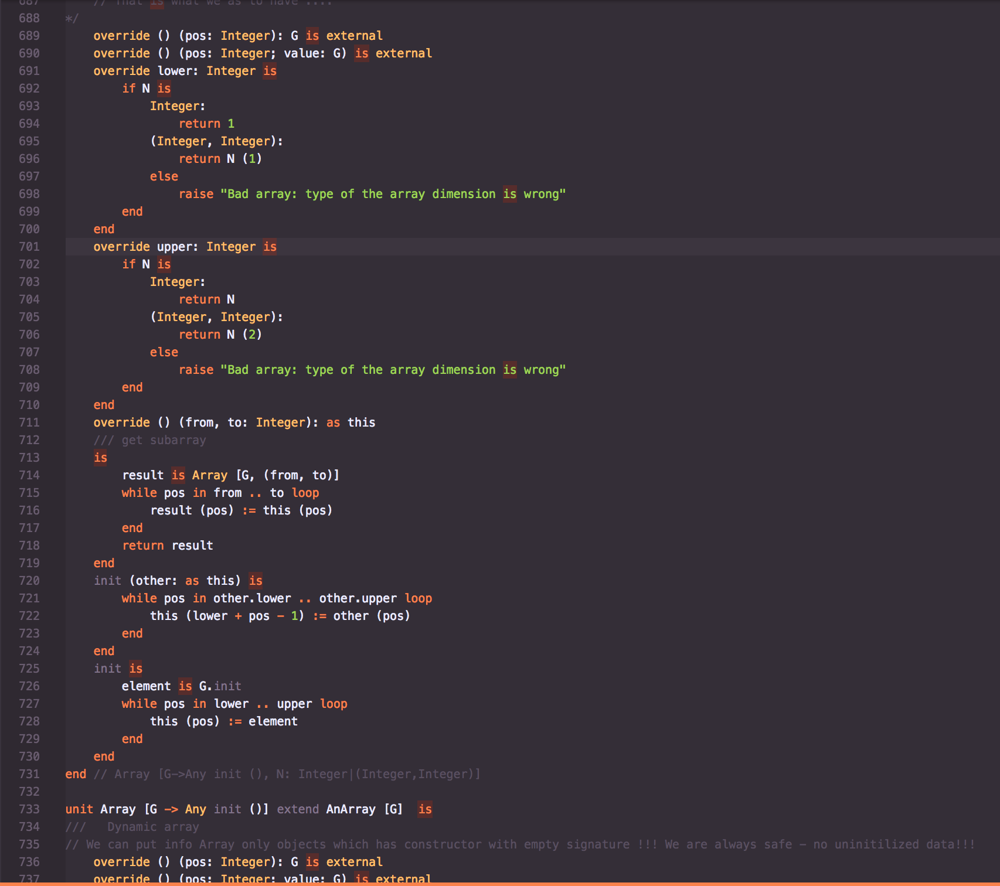

# SLang code highlighter

 

<!-- 
> Tip: Many popular extensions utilize animations. This is an excellent way to show off your extension! We recommend short, focused animations that are easy to follow. -->

<!-- ## Known Issues -->

## Release Notes

### 0.0.1

Initial release of extension.

## 0.0.2

- Add few more keywords support

## 0.0.3

- Add few more keywords support

## 0.1.0

- Add logo

-----------------------------------------------------------------------------------------------------------
